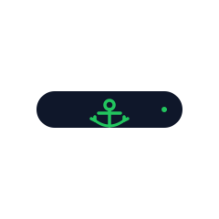

<p align="center">
  
</p>

<h1 align="center">Anchor</h1>

<p align="center"><b>macOS 灵动岛专注力工具 —— 桅杆上的瞭望员，不是狱卒。</b></p>

<p align="center">
  <a href="https://github.com/TIFOSI528/anchor/releases/latest"></a>
  <a href="https://github.com/TIFOSI528/anchor/actions/workflows/ci.yml"></a>
  
  
  <a href="LICENSE"></a>
  <a href="https://github.com/TIFOSI528/anchor/releases"></a>
</p>

<p align="center">
  
  <br/><sub>三幕循环：绿区隐形 → 漂移展开倒计时 → 单击拉回（设计演示）</sub>
</p>

<p align="center">中文 · <a href="README.en.md">English</a></p>

---

你在写代码，手却点开了推特——Anchor 不会锁死它，只是让灵动岛亮起一个倒计时，屏幕随着漂移时间渐渐起雾，单击一下就回到刚才的工作。**不屏蔽、不审判，只是在你漂走时轻轻拽一下。**

## 特性

- **灵动岛形态** —— 刘海机型贴原生刘海展开，无刘海机型化作菜单栏胶囊（空闲只占一个小圆点，且点击穿透，不挡系统图标）
- **三区规则** —— 绿区（当前任务允许的 app/网站）几乎无感；灰区（未分类）放行但开始漂移倒计时；红区（黑名单）立即介入，留 5 秒手滑缓冲
- **Tab 级粒度** —— 配合 Chrome 扩展，规则可以精确到 URL：`github.com/你的仓库` 是绿区，`github.com/trending` 是红区
- **一键拉回** —— 单击灵动岛，立刻切回最近的工作 app（< 200ms）
- **合法摸鱼** —— 长按 3 秒承认"我就是想歇会儿"，光明正大休息 5 分钟；每天前 3 次到点温柔询问，之后强制拉回
- **Focus Lock** —— 「只看这个」：把当前页面 / 站点 / app 设为唯一绿区，读一篇论文时连平时的绿区都算漂移
- **渐进摩擦** —— 屏幕模糊随漂移时长沿曲线加深，是提醒不是惩罚；所有干预都能在设置里一键关闭
- **叙事化复盘** —— 每晚 22:00 一封"朋友写给你的信"：Deep Score（公式公开）、24h 时间线、本周热力图、今日罪人榜、漂移链；周日自动给一条可一键应用的规则建议
- **Local-first** —— 数据只存本地 SQLite，零账号、零遥测、零订阅，GPL-3.0 开源

## 安装

从 [**Releases**](https://github.com/TIFOSI528/anchor/releases/latest) 下载最新 `Anchor-x.y.z.dmg`，拖入「应用程序」即可（已签名公证，无 Gatekeeper 拦截）。内置 Sparkle 自动更新。

**浏览器扩展**（启用 tab 级判定，可选但强烈推荐）：

1. 在同一 [Releases](https://github.com/TIFOSI528/anchor/releases/latest) 页下载 `anchor-chrome-extension-x.y.z.zip` 并解压
2. Chrome 打开 `chrome://extensions`，右上角开启「开发者模式」→「加载已解压的扩展程序」→ 选中解压目录
3. Anchor 设置 → 通用 里的连接状态变绿即生效

> 也可以不下载 zip：设置 → 浏览器扩展 → **安装指南** 会直接定位 app 内置的扩展目录。Chrome Web Store 上架在计划中，目前 zip 是官方渠道。

<details>
<summary>从源码构建</summary>

```bash
git clone https://github.com/TIFOSI528/anchor.git && cd anchor
swift build -c release
zsh scripts/package-app.sh    # → output/Anchor.app + dmg
```

需求：macOS 14+ / Xcode 16+ / Swift 6.0+。开发循环 `open Package.swift`，测试 `swift test`。
</details>

## 快速上手

1. 启动后：菜单栏出现 **⚓ 图标**，屏幕顶部中央一个**呼吸绿点**
2. 菜单栏 → **场景** → 选一个（内置「写代码 / 读资料 / 随便看看」，可自定义规则，支持 `*` 通配）
3. 切到无关 app 试试——绿点原地展开成倒计时胶囊，**单击它**立刻回到工作
4. 漂移当下想拉黑某个 app / 网站？菜单栏 → **「把当前 app / 站点加入红区」**，立即生效

### 快捷键

| 快捷键 | 动作 |
|---|---|
| `⌃⌥⌘A` | 立即拉回最近的绿区 app |
| `⌃⌥⌘B` | 合法摸鱼 5 分钟 |
| `⌃⌥⌘L` | Focus Lock：锁定 / 解除「只看这个」 |
| `⌃⌥⌘P` | 暂停看护（≥10 字理由，进当晚复盘）；再按一次恢复 |

## 权限与隐私

| 能力 | 所需权限 |
|---|---|
| 前台 app 监控、灵动岛、复盘 | **无需任何权限** |
| 浏览器 tab 判定 | 扩展（仅连本机 `127.0.0.1`，不出网） |
| 全局快捷键、滚动锁（默认关） | 辅助功能（可选，不授权则静默降级） |

所有数据保存在 `~/Library/Application Support/Anchor/` 的 SQLite 里，没有账号、没有云、没有任何遥测。「为什么不上 Mac App Store？」——沙盒会禁掉前台监控这条命根子，所以走签名公证的直接分发。

## 设计立场

**不做硬屏蔽**（永远留逃生通道）、**不做社交压力**（自律工具不该有排行榜）、**不做云和遥测**。完整的产品哲学、灵动岛规范、复盘规范、技术架构见 [`docs/`](docs/)。

## 参与

- 提 bug / 建议：[Issues](https://github.com/TIFOSI528/anchor/issues) · 流程见 [CONTRIBUTING.md](CONTRIBUTING.md)
- 版本历史：[CHANGELOG.md](CHANGELOG.md) · 发版流程：[RELEASING.md](RELEASING.md)

---

<p align="center"><b>一根隐形的橡皮筋，系在你和你的任务之间。</b><br/>
<sub>GPL-3.0 · Built with <a href="https://github.com/MrKai77/DynamicNotchKit">DynamicNotchKit</a> · <a href="https://sparkle-project.org">Sparkle</a> · <a href="https://github.com/stephencelis/SQLite.swift">SQLite.swift</a> · 交互范式参考 <a href="https://github.com/Octane0411/open-vibe-island">open-vibe-island</a></sub></p>
